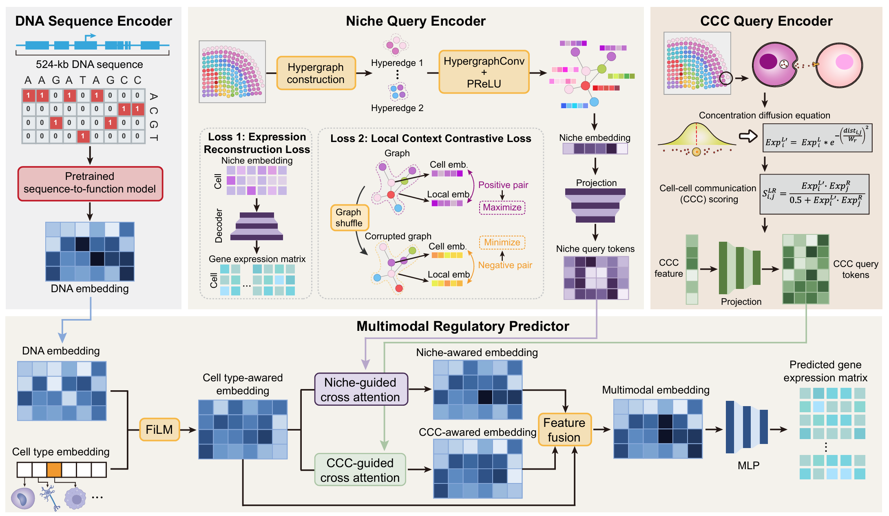

# GenoSpatial

GenoSpatial is a context-aware sequence-to-expression framework that conditions gene-centred genomic sequence on cell identity, local spatial environment and receiver-side cell–cell communication features.

<p align="center">
  
</p>

## Repository scope

The current public release is limited to the main-model mouse-brain training implementation. It does not provide the complete analysis collection associated with the manuscript.

This repository contains no training data or pretrained checkpoint.

## Installation

Create an isolated Python environment, then install the declared dependencies:

```bash
pip install -r requirements.txt
```

Exact package versions were not recorded in the authoritative training notebook. See `docs/training_provenance.md` before selecting versions for an archival environment.

## Required upstream inputs

Paths and object keys are configured in `configs/mouse_brain.yaml`. The example paths are placeholders and must be replaced with local paths to compatible files.

### Sequence embeddings

- Format: HDF5.
- Layout: one root-level dataset per gene, keyed by gene name.
- Expected array shape: `624 × 1920` for each gene in the frozen configuration.
- Data type: numeric and convertible to PyTorch `float32`.
- Use: HDF5 keys are intersected with expression-matrix gene names; each embedding is loaded lazily for a `(spatial subcluster, gene)` sample.

The authoritative workflow generated these gene-centred embeddings upstream. That generation workflow is outside the current release scope.

### Expression and environment H5AD

- Matrix: `X`, observations × genes; values are used as stored and converted to `float32` by the training Dataset.
- Gene identifiers: `var_names`; they must match GTF `gene_name` values and sequence-HDF5 keys.
- Required observation column: `X_hg_final_cluster`, containing spatial niche labels.
- Required multidimensional observation field: `obsm['X_hg_final_emb']` with one row per observation and 128 columns in the frozen configuration.
- Role: expression targets, niche labels and local environment representations.

The training code does not introduce an additional expression normalization step.

### STCase H5AD

- Observation index: identifiers used to subset and order the expression/environment H5AD.
- `uns['LR_pair_information']`: convertible to a table indexed by LR-pair name with `ligand` and `receptor` fields.
- `uns['DB_complex']`: table indexed by complex name; row values contain component genes, with empty entries ignored according to the frozen code.
- `uns['LR_cell_weight']`: mapping from LR-pair name to an observations × observations communication-weight matrix.
- Role: cell alignment, LR test-gene exclusion, and sender/receiver CCC feature construction. Main-model training consumes the receiver features.

The two H5AD files must describe compatible cell identifiers. CCC matrix dimensions must equal the STCase observation count.

### Gene annotation

- Format: nine-column GTF.
- Required records: rows with `feature` equal to `gene` and an extractable `gene_name` attribute.
- Role: map sequence-matched genes to chromosomes and apply the frozen chromosome split.

When a gene name occurs more than once, the first matching `gene` record is used, as in the authoritative notebook.

### Cell-type labels

- Format: CSV read with the first column as row index.
- Required content: exactly one data column containing cell-type labels.
- Row index: cell identifiers alignable to the expression/environment H5AD.
- Role: create cell-type embeddings and cell-type × niche spatial subclusters.

## Frozen preprocessing summary

The public implementation preserves the notebook operation order: sequence/expression gene matching, indexed cell-type assignment, STCase observation alignment, GTF chromosome assignment, test-linked LR exclusion, sender/receiver CCC construction, niche filtering, cell-type × niche filtering, subcluster means and marker-score-derived gene weights.

The default thresholds are 500 cells per niche and 150 cells per cell-type × niche subcluster. Test fixtures may override these values to remain small; the distributed configuration retains the frozen defaults.

The implemented chromosome split is:

- train: chr1–chr12 and chrX;
- validation: chr13–chr15;
- test: chr16–chr19.

## Training

Edit the paths in `configs/mouse_brain.yaml`, then run:

```bash
python scripts/train_mouse_brain.py \
    --config configs/mouse_brain.yaml
```

This command performs preprocessing directly from the five upstream inputs and starts main-model training.

## Optional preprocessing cache

The cache is a performance optimization and is not an independent scientific input. The direct and cached routes call the same preprocessing implementation.

To create it explicitly:

```bash
python scripts/prepare_mouse_brain.py \
    --config configs/mouse_brain.yaml
```

Then train with a configuration whose `cache.mode` is `require`, such as `configs/mouse_brain_cached.yaml` after updating its paths. Supported modes are:

- `off`: recompute from upstream inputs and do not read the cache;
- `auto`: use a matching cache, otherwise recompute and replace it;
- `require`: reject a missing or mismatched cache.

Cache validation includes input file identity, preprocessing fields, chromosome split and model input dimensions. Original upstream files remain required for signature validation.

## Output

The configured output directory receives:

- `best_Advtrimodal_model_v12_r.pth`: model `state_dict` selected by weighted validation Huber loss;
- `best_Advtrimodal_model_v12_r.pth.metadata.json`: realized cell-type mapping, LR feature order, gene orders, subcluster order and configuration;
- `training_history.json`: optimizer steps, cumulative within-epoch training loss, validation loss and validation Pearson correlation for each validation event;
- console progress messages at every validation event.

The checkpoint selection criterion is validation loss, not correlation.

## Reproducibility notes

- The source notebook does not set a Python, NumPy or PyTorch random seed. Seed provenance is therefore unavailable, and bitwise reproduction of the saved training trajectory cannot be claimed.
- Gene intersection and cell-type mapping use set-derived order in the frozen implementation. The public code preserves this behavior and records each realized order/mapping beside the checkpoint.
- The model validates every 250 optimizer steps and stops after ten consecutive validation events that do not improve validation loss by the configured minimum delta.
- Exact dependency versions are unavailable from the notebook.

See `docs/training_provenance.md` for calculation-level provenance and known reproducibility limitations.

## Data availability

No upstream data file is redistributed in this repository. Exact public sources and accession identifiers for all required processed inputs are not yet uniquely recoverable from the archived project files and will be added when author-confirmed. Users must provide compatible upstream inputs locally.

## Citation

If you use GenoSpatial, please cite the associated manuscript when available and cite this software repository. GitHub-compatible citation metadata are provided in `CITATION.cff`.

## License

This software is released under the MIT License. See `LICENSE`.

## Tests

After installing `requirements.txt`, run the synthetic and regression suite without any private data:

```bash
pytest tests -q
```

Synthetic fixtures may override dimensions and thresholds only inside tests. The shipped example configurations retain the authoritative notebook's frozen scientific settings.
